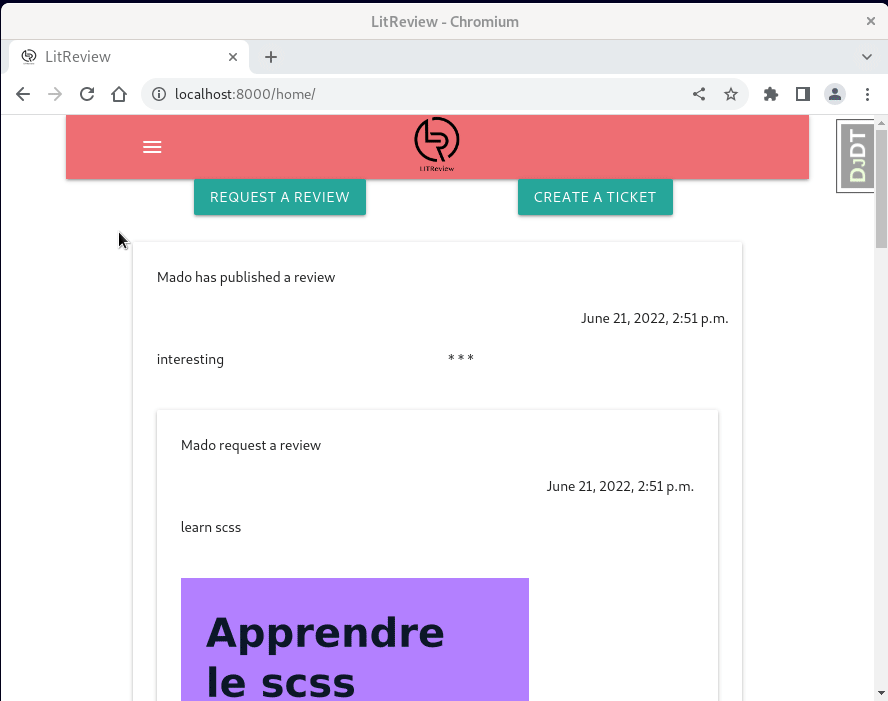
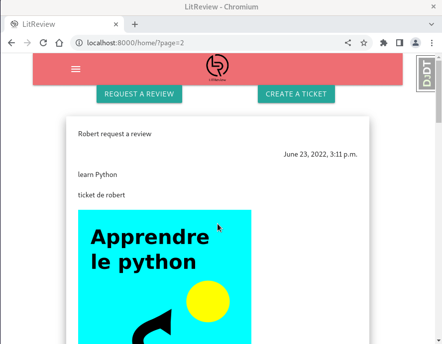
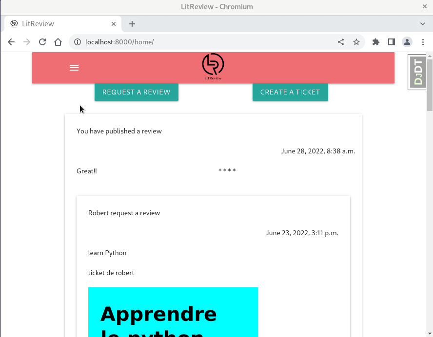

# Projet9: develop a web application using django

## Goals: 
Ultimately, our goal will be to manage a web application to issue and/or view book reviews

version: 0.0.1

## Summary

[Install](#install)

[Use](#use)

[Todo](TODO.md)

[Changelog](CHANGELOG.md)

------------
### <a name="install"></a>Install

This setup is for a development environment.

Prerequisite:

- \>= python3,9

Through a terminal(Debian linux) or Powershell(Windows) : 

Position yourself in the local directory in which you want to position the sources of the application
``` bash
 cd [path_to_source_directory]
```
-  Clone the repository via the clone command in ssh mode
[ssh](https://docs.github.com/en/authentication/connecting-to-github-with-ssh), via la commande suivante

``` bash
 git clone git@github.com:DelphinePythonique/projet9.git
```

- Position yourself in the project directory, create a virtual environment

``` bash
 cd projet9
 python -m venv env
```
- Activate virtual environment

   If OS is Debian Linux: 
``` bash
 source env/bin/activate
```
   If OS is Windows:
``` bash
 .\env\Scripts\activate
```
- Install dependencies
``` bash
 pip install -r requirements.txt
```
- Install dev dependencies
``` bash
 pip install -r requirements_dev.txt
```

The settings are in the files present in the directory: litreview/litreview/settings/. 
The base.py file corresponds to the parameters common to all the environments: development, production, etc.
The secret_settings file serves as a template for all environment-specific settings
- duplicate litreview/litreview/settings/secret_settings.py for each of your environment like local.py, production.py for example
- change key's values , for example
``` python
 SECRET_KEY = "django-insecure-ceciestmasecretkeymouahahh"
 DATABASES = {
    "default": {
        "ENGINE": "django.db.backends.sqlite3",
        "NAME": BASE_DIR / "../litreview.sqlite3",
    }
}
```
- in terminal, go to in directory which containt manage.py
- if you do not want use the default database, you can: 
  - generate database and populate it
  - create superuser -> answer questions
``` bash
 python manage.py migrate --settings=litreview.settings.local --run-syncdb
 python manage.py createsuperuser --settings=litreview.settings.local
```
- start development server 
``` bash
 python manage.py runserver 8000 --settings=litreview.settings.local
```
- generate the flake8-html report
``` bash
  flake8 --format=html --htmldir=flake-report --exclude=env
```
- it is possible to update style into litreview/sass/_style.scss and run following command to refresh style.css
``` bash
  npm run sass
```
### <a name="use"></a>Uses

#### Sign up

#### Log in
for the default database, some user are populated: 
root => username: root / password: litreview
for the others users, username is display and password is litreview

#### Create a ticket

#### Create a ticket with review

#### Follow a user

#### Create review for an other user's book

#### Delete review 

#### Delete ticket
same as review but with a ticket